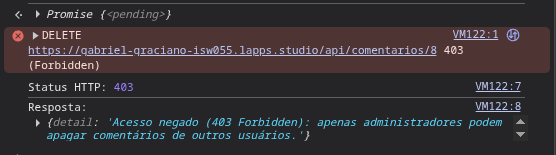
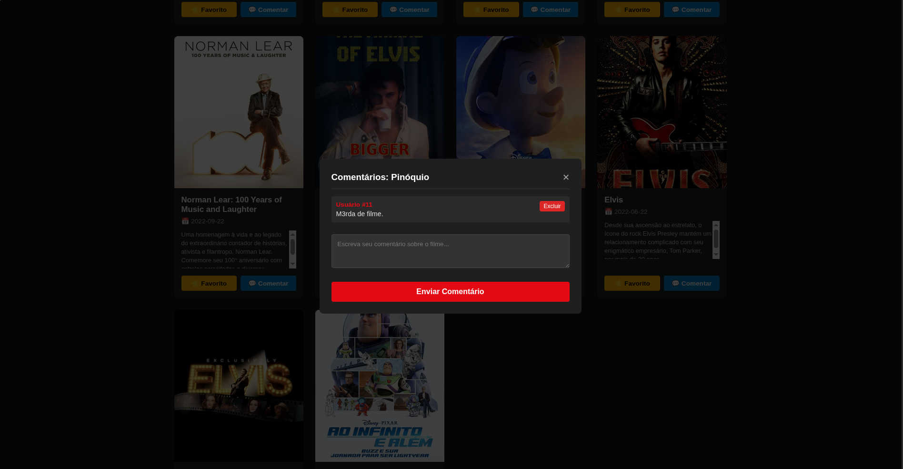
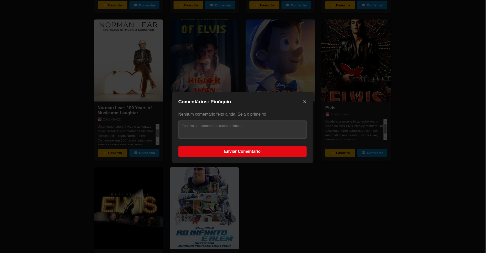
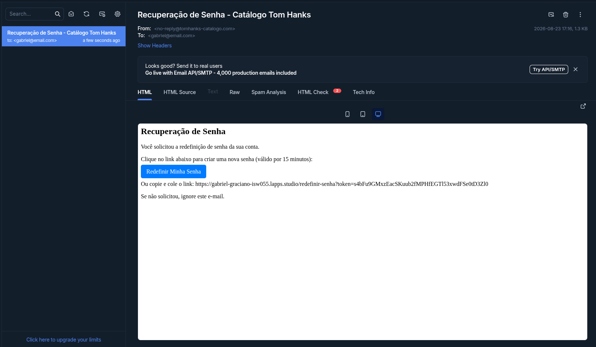
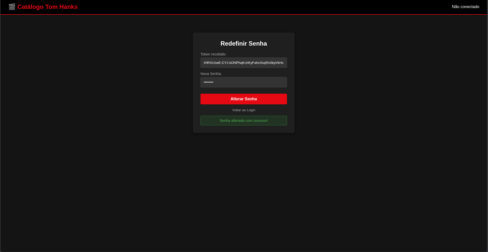
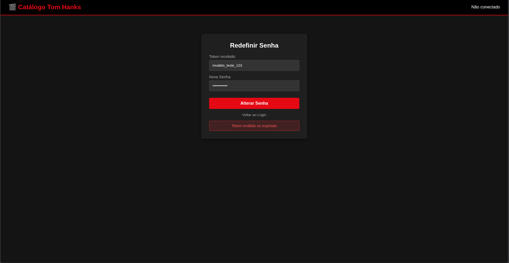

# 🎬 Catálogo de Filmes Tom Hanks - Microsserviços e RBAC

**Aluno:** Gabriel Castão Graciano  
**Disciplina:** Introdução à Computação em Nuvem  
**Professor:** [siriani](https://github.com/siriani)  

---

## 🔗 Acesso Rápido

* **Aplicação em Produção:** [https://gabriel-graciano-isw055.lapps.studio/](https://gabriel-graciano-isw055.lapps.studio/)
* **Repositório do Projeto:** [https://github.com/Gabriel33-fis/catalogo-tom-hanks](https://github.com/Gabriel33-fis/catalogo-tom-hanks)

---

## 🔐 1. Matriz de Permissões por Papel (RBAC)

A autorização é aplicada estritamente no backend (`catalogo_service` / `auth_service`), garantindo que nenhuma ação privilegiada dependa de validações puramente cosméticas na interface.

| Recurso / Ação | Papel: `usuario` | Papel: `admin` | Validação no Backend |
| :--- | :---: | :---: | :--- |
| **Visualizar Catálogo (TMDB)** | ✅ Permitido | ✅ Permitido | Requer autenticação JWT válida |
| **Gerenciar Favoritos Próprios** | ✅ Permitido | ✅ Permitido | Isolado por `usuario_id` no banco |
| **Criar Comentários** | ✅ Permitido | ✅ Permitido | Requer autenticação JWT válida |
| **Apagar Próprio Comentário** | ✅ Permitido | ✅ Permitido | Valida `comentario.usuario_id == current_user.id` |
| **Apagar Comentário de Terceiros (Moderação)** | ❌ **Negado (403)** | ✅ Permitido | Valida claim `papel == 'admin'` |

---

## 🏗️ 2. Arquitetura de Autorização: Padrão A vs Padrão B

### Resposta Curta:
* **Padrão utilizado no projeto:** **PADRÃO B (Claims no Token JWT)**.
* **Como funciona hoje:** No momento do login, o `auth_service` inclui a claim de identificação e papel (`usuario_id`, `email`, `papel`) diretamente no payload do token JWT assinado criptograficamente com HMAC-SHA256 (`HS256`). O `catalogo_service` decodifica e valida a assinatura localmente através do middleware `auth_guard`, realizando o enforcement de permissões de forma stateless e sem latência de rede adicional.

### O que mudaria se fossemos para o PADRÃO A (Enforcement Centralizado)?
* **Alterações no `auth_service`:** Seria necessário criar um endpoint centralizado de autorização (ex: `POST /api/auth/authorize` ou `POST /api/auth/can-perform`) que receberia o token/identificador do usuário e o recurso/ação solicitada (ex: `acao: "apagar:comentario-de-outro"`), consultando as tabelas de papéis e permissões no banco a cada requisição.
* **Alterações no `catalogo_service`:** A rota `DELETE /api/comentarios/{comentario_id}` deixaria de inspecionar diretamente o payload decodificado e passaria a fazer uma requisição síncrona HTTP/gRPC para o `auth_service` perguntando se o usuário possui a permissão requerida antes de prosseguir com a exclusão.
* **Trade-offs:** 
  * *Vantagem do Padrão A:* Mudanças de papéis ou revogações teriam efeito imediato.
  * *Desvantagem do Padrão A:* Cada ação sensível geraria round-trips extras na rede Docker interna, tornando o `auth_service` um ponto central de gargalo de performance e ponto único de falha (*Single Point of Failure*).

---

## 📸 3. Evidências Práticas de Funcionamento

### Atividade 4 - RBAC (Enforcement no Backend)
1. **Tentativa de Usuário Comum apagando comentário de outro usuário (HTTP 403 Forbidden):**

   

2. **Administrador moderando e apagando o comentário de outro usuário com sucesso (HTTP 200 OK):**

   

   

---

### Atividade 3 - Autenticação e Recuperação de Senha
1. **E-mail de recuperação recebido no Mailtrap:**

   

2. **Sucesso na redefinição de senha:**

   

3. **Bloqueio de segurança com token inválido/expirado:**

   