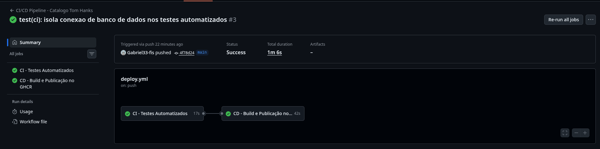
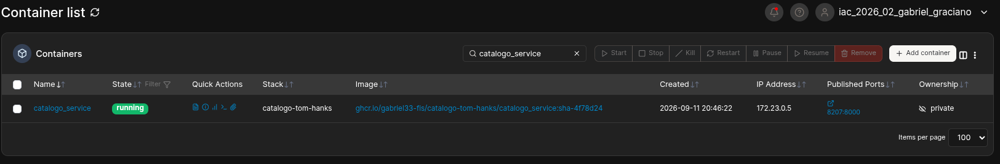
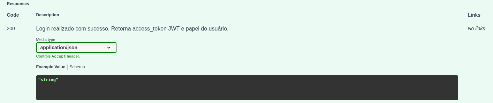
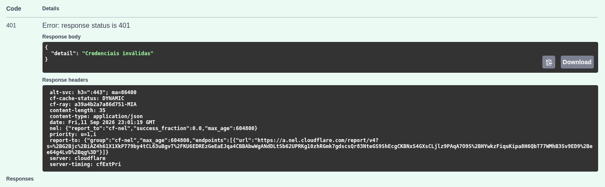
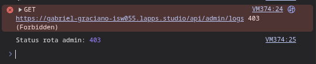
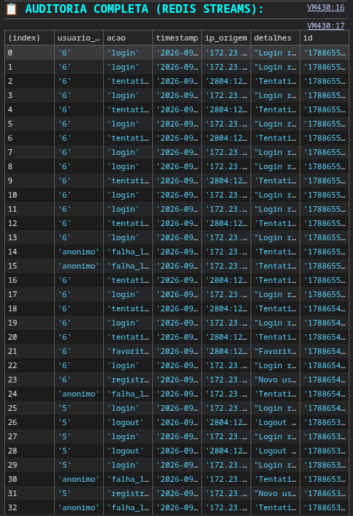

# 🎬 Catálogo de Filmes Tom Hanks - Microsserviços e RBAC

**Aluno:** Gabriel Castão Graciano  
**Disciplina:** Introdução à Computação em Nuvem  
**Professor:** [siriani](https://github.com/siriani)  

---

## 🔗 Acesso Rápido

* **Aplicação em Produção:** [https://gabriel-graciano-isw055.lapps.studio/](https://gabriel-graciano-isw055.lapps.studio/)
* **Repositório do Projeto:** [https://github.com/Gabriel33-fis/catalogo-tom-hanks](https://github.com/Gabriel33-fis/catalogo-tom-hanks)
* **Perfil do Professor:** [github.com/siriani](https://github.com/siriani)

---

---

# 📌 1. Arquitetura da Pipeline (Requisitos 1, 2 e 4)

A esteira de integração e entrega contínua foi configurada via workflow automatizado do GitHub Actions ([`.github/workflows/deploy.yml`](./.github/workflows/deploy.yml)):

* **CI (Continuous Integration - Requisito 1):** A cada evento de `push` na branch `main`, o runner provisiona o ambiente Python 3.11, instala as dependências e executa os testes automatizados com `pytest` ([`catalogo_service/test_main.py`](./catalogo_service/test_main.py)). Se qualquer teste quebrar, a esteira é abortada antes do build.
* **CD com Tag Rastreável (Requisito 2):** Com a validação dos testes, a imagem Docker é compilada e publicada no GitHub Container Registry (`ghcr.io`) etiquetada com a tag `latest` e com a tag imutável amarrada ao hash do commit: `sha-4f78d24`.
* **Deploy no Portainer (Requisito 4):** A stack de microsserviços consome a imagem oficial diretamente do registry via `ghcr.io/gabriel33-fis/catalogo-tom-hanks/catalogo_service:sha-4f78d24`, eliminando a necessidade de builds manuais locais no servidor.

---

## 🔐 2. Gestão de Segredos e Isolamento de Credenciais (Requisito 3)

Em conformidade rigorosa com a regra de nunca expor credenciais em código versionado:

* **No Workflow de CI/CD:** Nenhuma senha, token ou chave de API está hardcoded no arquivo YAML. A autenticação com o GHCR é realizada através do token efêmero nativo `${{ secrets.GITHUB_TOKEN }}`, injetado de forma segura em tempo de execução.
* **No `docker-compose.yml`:** Todas as credenciais sensíveis (`DB_PASSWORD`, `JWT_SECRET`, `TMDB_API_KEY`, `MAILTRAP_USER`, `MAILTRAP_PASS`) utilizam interpolação por variáveis de ambiente (`${VARIAVEL}`).
* **No Ambiente de Produção (Portainer):** Os valores reais são injetados diretamente pelo painel de *Environment variables* da Stack no Portainer (ou arquivo `.env`), mantendo o repositório público totalmente protegido.
* **Modelo de Configuração:** Disponibilizado o template seguro [`/.env.example`](./.env.example) para reprodução do ambiente sem vazamento de segredos.

---

## 🔗 3. Execução da Pipeline no GitHub Actions (Requisito 5)

* **Status da Execução:** Aprovado (Verde)  
* **Link Direto do Workflow Run:** [Visualizar Execução no GitHub Actions](https://github.com/Gabriel33-fis/catalogo-tom-hanks/actions/runs/34658129659)



---

## 📸 4. Evidência do Container Rodando com a Tag do Commit (Requisito 5)

Registro do painel do Portainer evidenciando o container `catalogo_service` em execução com a imagem rastreável amarrada ao commit (`sha-4f78d24`), e não a `latest`:


---

## 🔗 2. Execução da Pipeline no GitHub Actions (Requisito 5)

* **Execução com Status Verde:** [https://github.com/Gabriel33-fis/catalogo-tom-hanks/actions/runs/34658129659](https://github.com/Gabriel33-fis/catalogo-tom-hanks/actions)


---

## 📸 3. Evidência do Container Rodando com a Tag do Commit (Requisito 5)

Painel do Portainer comprovando a execução do container `catalogo_service` utilizando a imagem com a tag rastreável do commit (`sha-4f78d24`):


---

### 🔐 Gestão de Segredos e Variáveis de Ambiente (Requisito 3)

Em conformidade com as diretrizes de segurança:
* **Esteira de CI/CD (GitHub Actions):** Nenhuma credencial privada reside no arquivo `.github/workflows/deploy.yml`. A autenticação com o GHCR ocorre por meio do token temporário `${{ secrets.GITHUB_TOKEN }}` fornecido pelo próprio GitHub em tempo de execução.
* **Ambiente de Produção (Portainer):** Todas as credenciais sensíveis (`DB_PASSWORD`, `JWT_SECRET`, `TMDB_API_KEY` e credenciais SMTP) foram desacopladas do repositório através de sintaxe de interpolação (`${VARIAVEL}`). Os valores reais são preenchidos exclusivamente nas variáveis de ambiente da Stack no Portainer (`.env`), garantindo isolamento total do código-fonte público.

---

# 📖 Atividade Extra [1]: Documentação de APIs com OpenAPI e Swagger

## 📌 1. Contratos dos Microsserviços (Requisito 1)

Foram documentados os contratos de interface de **2 microsserviços** da solução utilizando OpenAPI 3.1 e Swagger UI:

* **`catalogo_service`:** Gestão de acervo via TMDB, favoritos, postagem e moderação de comentários com RBAC.
  * **Swagger UI Online:** [https://gabriel-graciano-isw055.lapps.studio/docs](https://gabriel-graciano-isw055.lapps.studio/docs)
  * **Contrato OpenAPI JSON:** [`docs/openapi_catalogo.json`](./docs/openapi_catalogo.json)
* **`auth_service`:** Cadastro, autenticação com emissão de tokens JWT assinados e recuperação de senhas via SMTP.
  * **Contrato OpenAPI JSON:** [`docs/openapi_auth.json`](./docs/openapi_auth.json)

---

## 📋 2. Endpoints e Tratamento de Erros (Requisito 2)

Todos os endpoints possuem tipagem estrita com Pydantic, parâmetros definidos e mapeamento explícito de status codes de retorno e exemplos de erro:

| Método | Rota | Descrição | Sucesso | Erros Mapeados |
| :--- | :--- | :--- | :--- | :--- |
| `POST` | `/api/auth/register` | Registro de novos usuários | `201 Created` | `400 Bad Request` |
| `POST` | `/api/auth/login` | Login e emissão de JWT | `200 OK` | `401 Unauthorized` |
| `POST` | `/api/auth/logout` | Encerramento de sessão com log | `200 OK` | `401 Unauthorized` |
| `POST` | `/api/auth/forgot-password` | Disparo de recuperação via SMTP | `200 OK` | `404 Not Found` |
| `POST` | `/api/auth/reset-password` | Alteração de senha com token | `200 OK` | `400 Bad Request` |
| `GET` | `/api/filmes` | Consulta de filmes no TMDB | `200 OK` | `401 Unauthorized` |
| `GET` | `/api/favoritos` | Listar favoritos do usuário logado | `200 OK` | `401 Unauthorized` |
| `POST` | `/api/favoritos` | Salvar filme nos favoritos | `201 Created` | `401 Unauthorized` |
| `DELETE` | `/api/favoritos/{id}` | Remover item dos favoritos | `200 OK` | `401 Unauthorized`, `404 Not Found` |
| `GET` | `/api/comentarios/{tmdb_id}` | Listar comentários por filme | `200 OK` | `401 Unauthorized` |
| `POST` | `/api/comentarios` | Publicar comentário | `201 Created` | `401 Unauthorized` |
| `DELETE` | `/api/comentarios/{id}` | Exclusão com moderação RBAC | `200 OK` | `401 Unauthorized`, `403 Forbidden`, `404 Not Found` |
| `GET` | `/api/admin/logs` | Consulta de logs (Redis Streams) | `200 OK` | `401 Unauthorized`, `403 Forbidden` |

---

## 📸 3. Evidências de Execução no Swagger (Requisito 4)

### Chamada Real com Sucesso (`POST /api/auth/login` -> 200 OK)


### Chamada Real com Erro Documentado (`POST /api/auth/login` -> 401 Unauthorized)


---

# 📊 Atividade 5: Auditoria com Redis Streams e RBAC

## 📌 Visão Geral da Arquitetura de Auditoria

Para monitoramento e segurança da aplicação, foi implementada uma camada assíncrona de auditoria distribuída utilizando **Redis Streams** e um novo microsserviço dedicado:
* **`log_service`**: Microsserviço responsável por receber eventos de auditoria e registrá-los em streams estruturados no Redis, além de disponibilizar a rota protegida de consulta para administradores.
* **`tom_hanks_redis`**: Instância do Redis 7 atuando como message broker e armazenamento em memória via streams (`XADD`/`XRANGE`).
* **Proteção por RBAC**: A rota `/api/admin/logs` exige obrigatoriamente a claim `papel: 'admin'` no token JWT. Usuários comuns são barrados com status **403 Forbidden**, e as tentativas de acesso indevido também são registradas no log.

---

## 📸 Evidências de Funcionamento (Atividade 5)

### 1. Bloqueio de Usuário Comum acessando Logs de Auditoria (HTTP 403 Forbidden)
Demonstração do RBAC bloqueando o acesso de usuário comum à rota restrita `/api/admin/logs`:



### 2. Consulta de Auditoria realizada com sucesso por Administrador (Redis Streams)
Visualização dos eventos capturados em tempo real (logins, favoritos, falhas de autenticação e tentativas negadas) através do payload de eventos do Redis Streams:



---

## 🐳 Orquestração (`docker-compose.yml`)

Trecho com a adição do serviço `log_service` e da instância `tom_hanks_redis`:

```yaml
version: '3.8'

services:
  catalogo_service:
    build: ./catalogo_service
    container_name: catalogo_service
    restart: always
    ports:
      - "8207:8000"
    environment:
      - DB_HOST=35.226.64.52
      - DB_PORT=3306
      - DB_USER=IAC_2026_02_gabriel_graciano
      - DB_PASSWORD=********
      - DB_NAME=IAC_2026_02_gabriel_graciano
      - TMDB_API_KEY=********
      - JWT_SECRET=********
      - AUTH_SERVICE_URL=http://auth_service:5000
      - LOG_SERVICE_URL=http://log_service:6000
    depends_on:
      - auth_service
      - log_service
    networks:
      - tom_hanks_net

  auth_service:
    build: ./auth_service
    container_name: auth_service
    restart: always
    environment:
      - DB_HOST=35.226.64.52
      - DB_PORT=3306
      - DB_USER=IAC_2026_02_gabriel_graciano
      - DB_PASSWORD=********
      - DB_NAME=IAC_2026_02_gabriel_graciano
      - JWT_SECRET=********
      - BASE_PUBLIC_URL=https://gabriel-graciano-isw055.lapps.studio
      - MAILTRAP_HOST=sandbox.smtp.mailtrap.io
      - MAILTRAP_PORT=2525
      - MAILTRAP_USER=********
      - MAILTRAP_PASS=********
      - LOG_SERVICE_URL=http://log_service:6000
    depends_on:
      - log_service
    networks:
      - tom_hanks_net

  log_service:
    build: ./log_service
    container_name: log_service
    restart: always
    environment:
      - REDIS_HOST=tom_hanks_redis
      - REDIS_PORT=6379
      - JWT_SECRET=********
    depends_on:
      - tom_hanks_redis
    networks:
      - tom_hanks_net

  tom_hanks_redis:
    image: redis:7-alpine
    container_name: tom_hanks_redis
    restart: always
    networks:
      - tom_hanks_net

networks:
  tom_hanks_net:
    driver: bridge

---
```

# 🛡️ Atividade 4: Controle de Acesso Baseado em Papel (RBAC)

## 🔐 1. Matriz de Permissões por Papel (RBAC)

A autorização é aplicada estritamente no backend (`catalogo_service`), garantindo que nenhuma ação privilegiada dependa de validações puramente cosméticas na interface.

| Recurso / Ação | Papel: `usuario` | Papel: `admin` | Validação no Backend |
| :--- | :---: | :---: | :--- |
| **Visualizar Catálogo (TMDB)** | ✅ Permitido | ✅ Permitido | Requer autenticação JWT válida |
| **Gerenciar Favoritos Próprios** | ✅ Permitido | ✅ Permitido | Isolado por `usuario_id` no banco |
| **Criar Comentários** | ✅ Permitido | ✅ Permitido | Requer autenticação JWT válida |
| **Apagar Próprio Comentário** | ✅ Permitido | ✅ Permitido | Valida `comentario.usuario_id == current_user.id` |
| **Apagar Comentário de Terceiros (Moderação)** | ❌ **Negado (403)** | ✅ Permitido | Valida claim `papel == 'admin'` |

---

## 🏗️ 2. Arquitetura de Autorização: Padrão A vs Padrão B

### Resposta Curta:
* **Padrão utilizado no projeto:** **PADRÃO B (Claims no Token JWT)**.
* **Como funciona hoje:** No momento do login, o `auth_service` inclui a claim de identificação e papel (`usuario_id`, `email`, `papel`) diretamente no payload do token JWT assinado criptograficamente com HMAC-SHA256 (`HS256`). O `catalogo_service` decodifica e valida a assinatura localmente através do middleware `auth_guard`, realizando o enforcement de permissões de forma stateless e sem latência de rede adicional.

### O que mudaria se fossemos para o PADRÃO A (Enforcement Centralizado)?
* **Alterações no `auth_service`:** Seria necessário criar um endpoint centralizado de autorização (ex: `POST /api/auth/authorize` ou `POST /api/auth/can-perform`) que receberia o token/identificador do usuário e o recurso/ação solicitada (ex: `acao: "apagar:comentario-de-outro"`), consultando as tabelas de papéis e permissões no banco a cada requisição.
* **Alterações no `catalogo_service`:** A rota `DELETE /api/comentarios/{comentario_id}` deixaria de inspecionar diretamente o payload decodificado e passaria a fazer uma requisição síncrona HTTP/gRPC para o `auth_service` perguntando se o usuário possui a permissão requerida antes de prosseguir com a exclusão.
* **Trade-offs:** 
  * *Vantagem do Padrão A:* Mudanças de papéis ou revogações teriam efeito imediato.
  * *Desvantagem do Padrão A:* Cada ação sensível geraria round-trips extras na rede Docker interna, tornando o `auth_service` um ponto central de gargalo de performance e ponto único de falha (*Single Point of Failure*).

---

## 📸 3. Evidências Práticas de Funcionamento (RBAC)

### 1. Tentativa de Usuário Comum apagando comentário de outro usuário (HTTP 403 Forbidden)


### 2. Administrador moderando e apagando o comentário com sucesso (HTTP 200 OK)
  


---

# 📦 Atividade 3: Microsserviços e Autenticação com SMTP

## 📌 Visão Geral da Arquitetura

A aplicação monolítica original foi desacoplada em uma **Arquitetura de Microsserviços**:
* **`auth_service`**: Microsserviço isolado em rede privada responsável por cadastro, login com hash de senha (`Bcrypt`), emissão de tokens JWT (`PyJWT`) e fluxo de recuperação de senha via SMTP.
* **`catalogo_service`**: Consome a API do TMDB para listar os filmes do ator Tom Hanks, atua como proxy do serviço de autenticação e gerencia favoritos e comentários com persistência no MySQL.
* **Isolamento de Rede**: O `auth_service` roda de forma privada dentro da rede interna Docker (`tom_hanks_net`), **sem portas expostas ao host**.

---

## 📸 Evidências de Funcionamento (Atividade 3)

### 1. E-mail de Recuperação Recebido no Mailtrap Sandbox


### 2. Confirmação de Senha Redefinida com Sucesso


### 3. Bloqueio de Segurança com Token Inválido/Expirado


## 🏗️ Diagrama e Rede Docker

```text
       [ Usuário / Navegador ]
                  │
                  ▼ Porta 8207 (Host)
      ┌───────────────────────┐
      │   catalogo_service    │  (FastAPI + UI + TMDB + MySQL)
      └───────────┬───────────┘
                  │  Rede interna: tom_hanks_net
                  │  (Sem porta pública pro host)
                  ▼
      ┌───────────────────────┐
      │     auth_service      │  (FastAPI + JWT + Mailtrap + MySQL)
      └───────────────────────┘

      version: '3.8'

services:
  catalogo_service:
    build: ./catalogo_service
    container_name: catalogo_service
    restart: always
    ports:
      - "8207:8000"
    environment:
      - DB_HOST=35.226.64.52
      - DB_PORT=3306
      - DB_USER=IAC_2026_02_gabriel_graciano
      - DB_PASSWORD=********
      - DB_NAME=IAC_2026_02_gabriel_graciano
      - TMDB_API_KEY=********
      - JWT_SECRET=********
      - AUTH_SERVICE_URL=http://auth_service:5000
    depends_on:
      - auth_service
    networks:
      - tom_hanks_net

  auth_service:
    build: ./auth_service
    container_name: auth_service
    restart: always
    # Sem seção 'ports' exposta ao host — isolado na rede interna
    environment:
      - DB_HOST=35.226.64.52
      - DB_PORT=3306
      - DB_USER=IAC_2026_02_gabriel_graciano
      - DB_PASSWORD=********
      - DB_NAME=IAC_2026_02_gabriel_graciano
      - JWT_SECRET=********
      - BASE_PUBLIC_URL=[https://gabriel-graciano-isw055.lapps.studio](https://gabriel-graciano-isw055.lapps.studio)
      - MAILTRAP_HOST=sandbox.smtp.mailtrap.io
      - MAILTRAP_PORT=2525
      - MAILTRAP_USER=********
      - MAILTRAP_PASS=********
    networks:
      - tom_hanks_net

networks:
  tom_hanks_net:
    driver: bridge